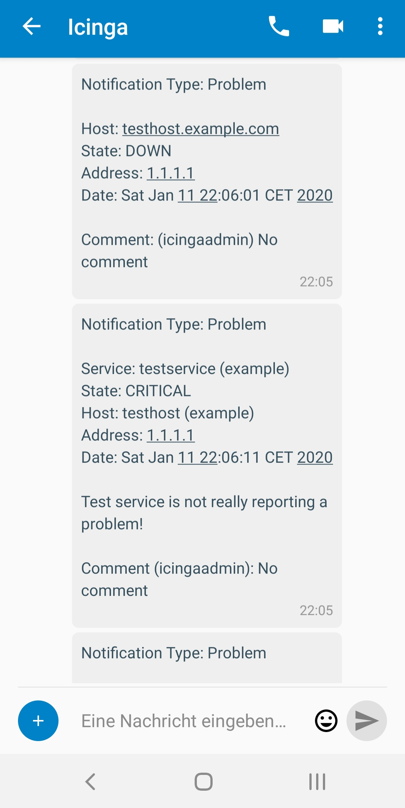

Icinga 2 Notifications to Nextcloud Talk
==================================

The repository shows how to configure Icinga 2 to send notifications via
[Nextcloud talk](https://nextcloud.com/de/talk/).

These can be send either to:
* Group Chats
* Personal User Chat

Please note that **only** the transport is encrypted, but not the actual
messages.

Checkout the example files to configure Icinga 2:

* [talk-host-notification.sh](talk-host-notification.sh)
* [talk-service-notification.sh](talk-service-notification.sh)
* [icinga2-example.conf](icinga2-example.conf)

## Screenshot

## Attribution

These scripts and examples are based on a blog post:
http://metz.gehn.net/2016/01/monitoring-notifications-via-telegram/

Please check out his post too, I just refitted it to fit my needs.

## License

Since the original Author didn't pick a license; but put it public, I will choose CC-BY

    Copyright (c) 2016 Stefan Gehn <metz@gehn.net>

    Creative Commons Attribution 2.0 Generic (CC BY 2.0)
    https://creativecommons.org/licenses/by/2.0/

    You are free to:

    * Share — copy and redistribute the material in any medium or format
    * Adapt — remix, transform, and build upon the material
      for any purpose, even commercially.

    The licensor cannot revoke these freedoms as long as you follow the license terms.

    Under the following terms:

    * Attribution — You must give appropriate credit, provide a link to the license,
      and indicate if changes were made. You may do so in any reasonable manner,
      but not in any way that suggests the licensor endorses you or your use.

    No additional restrictions — You may not apply legal terms or technological measures
    that legally restrict others from doing anything the license permits.
